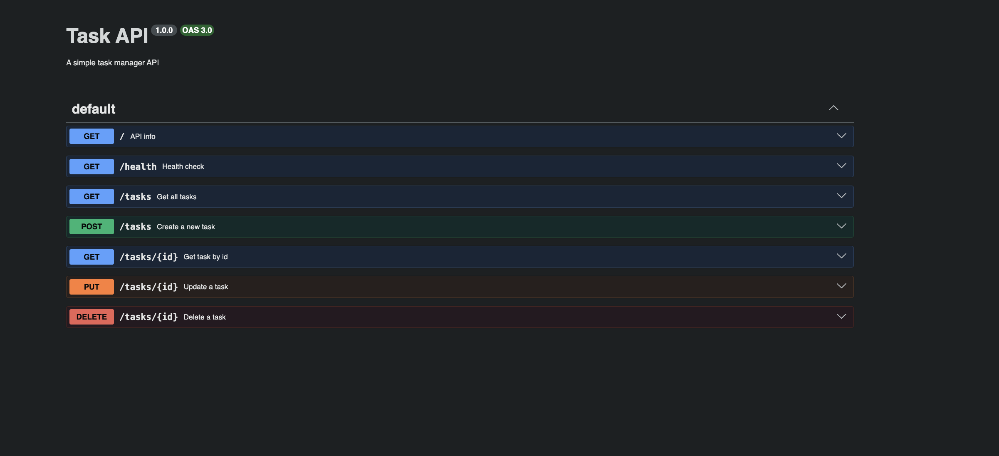
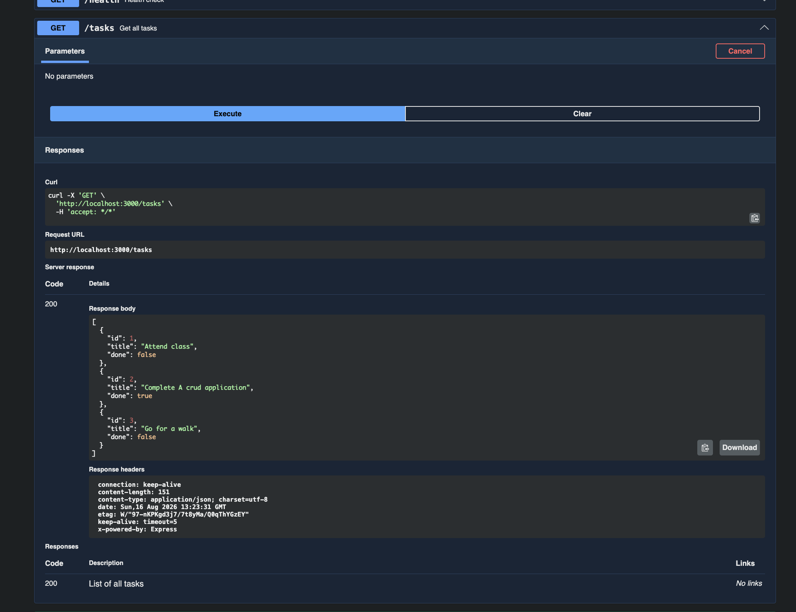
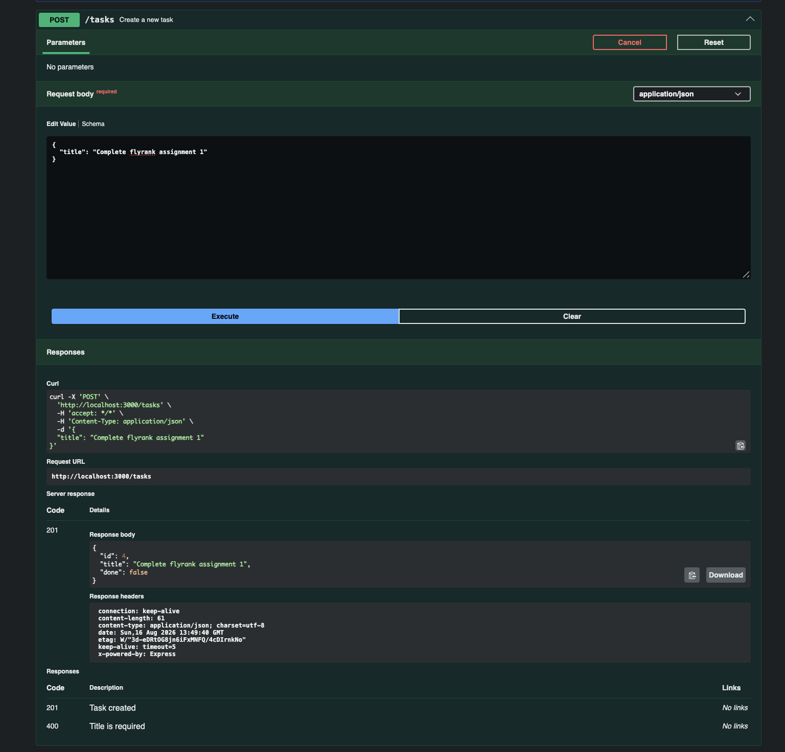
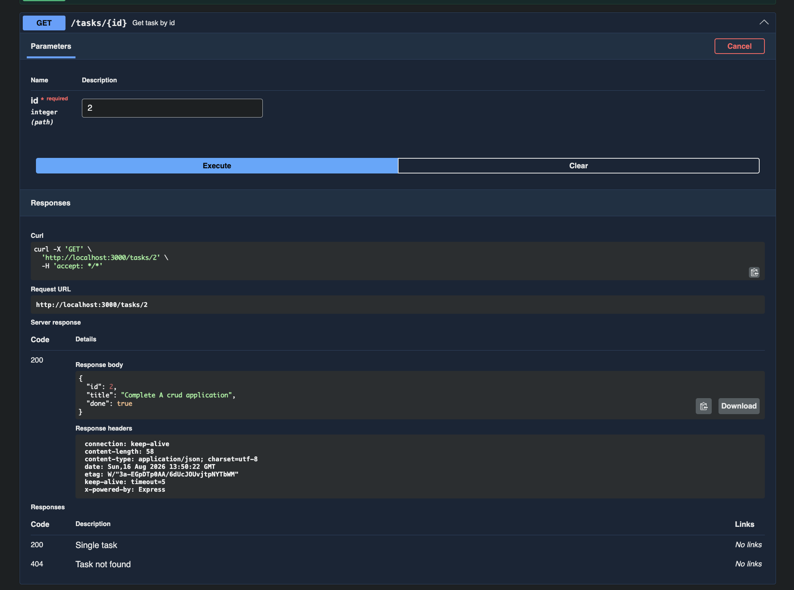
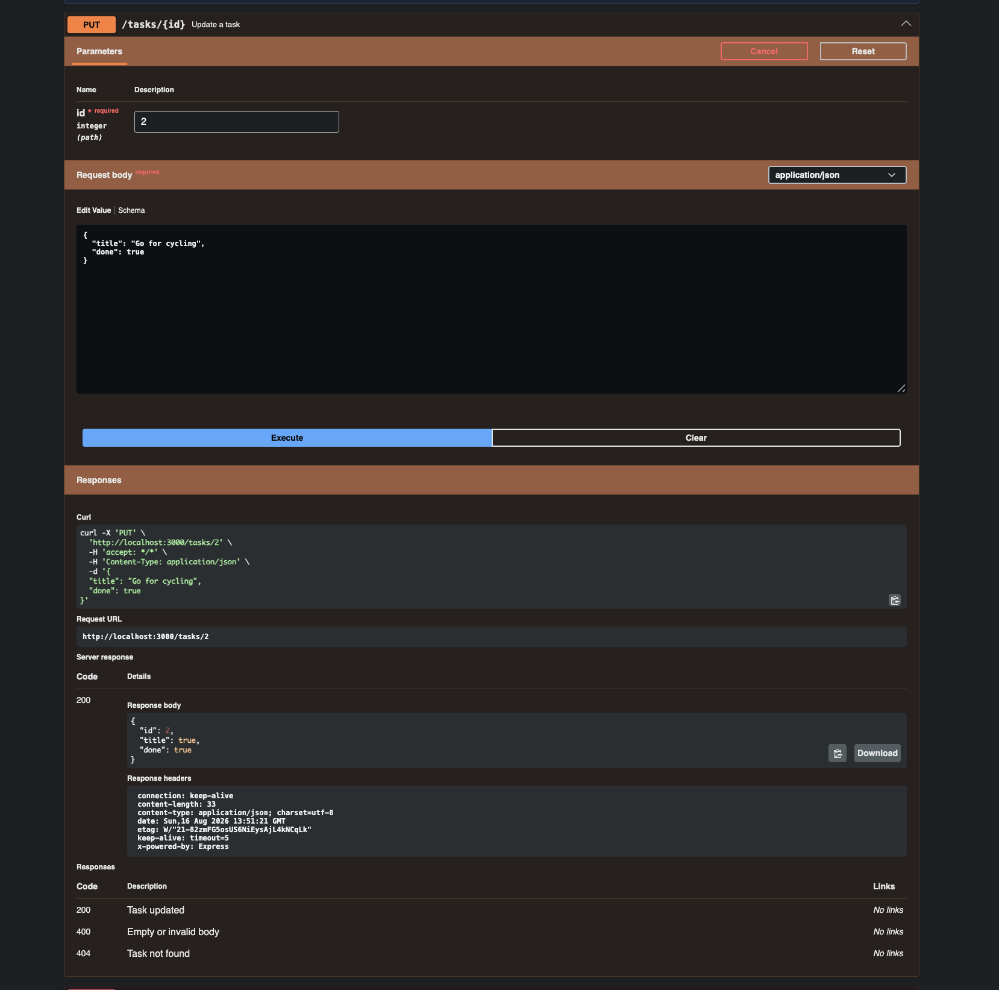
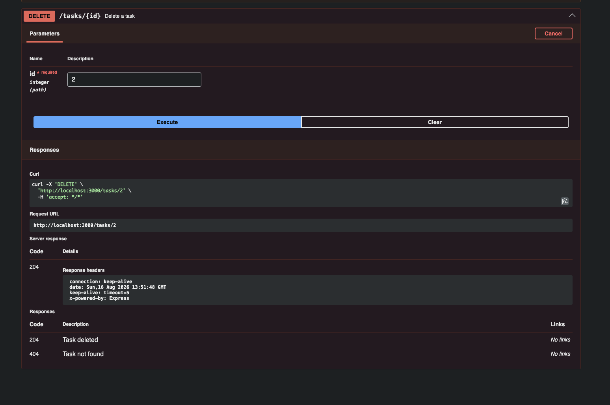

# Task API

A simple REST API built with Node.js and Express to manage tasks. Supports full CRUD — create, read, update, and delete tasks. Documented with Swagger UI.

## Tech Stack

- Node.js
- Express
- Swagger UI Express

## Getting Started

### Prerequisites

- Node.js installed
- npm installed

### Installation

```bash
# clone the repo
git clone https://github.com/Tushar-v01/First_Crud.git

# go into the folder
cd First_Crud
# install dependencies
npm install
```

### Run

```bash
nodemon index.js
```

Server runs at `http://localhost:3000`

## API Docs

Swagger UI available at:

```
http://localhost:3000/docs
```

## Screenshots

### Swagger UI — All Endpoints


### Swagger UI — GET /tasks


### Swagger UI — POST /tasks


### Swagger UI — GET(ID) /tasks


### Swagger UI — PUT /tasks/:id


### Swagger UI — DELETE /tasks/:id


## Endpoints

| Method | Route | Description |
|---|---|---|
| GET | `/` | API info |
| GET | `/health` | Health check |
| GET | `/tasks` | Get all tasks |
| GET | `/tasks/:id` | Get task by id |
| POST | `/tasks` | Create a new task |
| PUT | `/tasks/:id` | Update a task |
| DELETE | `/tasks/:id` | Delete a task |

## Example

```bash
$ curl -i http://localhost:3000/tasks

[
  { "id": 1, "title": "Attend class", "done": false },
  { "id": 2, "title": "Complete A crud application", "done": true },
  { "id": 3, "title": "Go for a walk", "done": false }
]
```

## Request & Response Examples

### POST /tasks

Request:
```json
{ "title": "Buy milk" }
```

Response `201`:
```json
{ "id": 4, "title": "Buy milk", "done": false }
```

### PUT /tasks/:id

Request:
```json
{ "title": "Buy eggs", "done": true }
```

Response `200`:
```json
{ "id": 1, "title": "Buy eggs", "done": true }
```

### DELETE /tasks/:id

Response `204` — no content

## Status Codes

| Code | Meaning |
|---|---|
| 200 | Success |
| 201 | Created |
| 204 | Deleted |
| 400 | Bad request / invalid input |
| 404 | Task not found |

## Project Structure

```
First_Crud/
├── index.js        ← entry point, all routes
├── openapi.json    ← swagger documentation
├── package.json    ← project config
├── README.md       ← this file
└── node_modules/   ← dependencies
```

## Note

This is an in-memory API — data resets every time the server restarts. No database connected yet.
